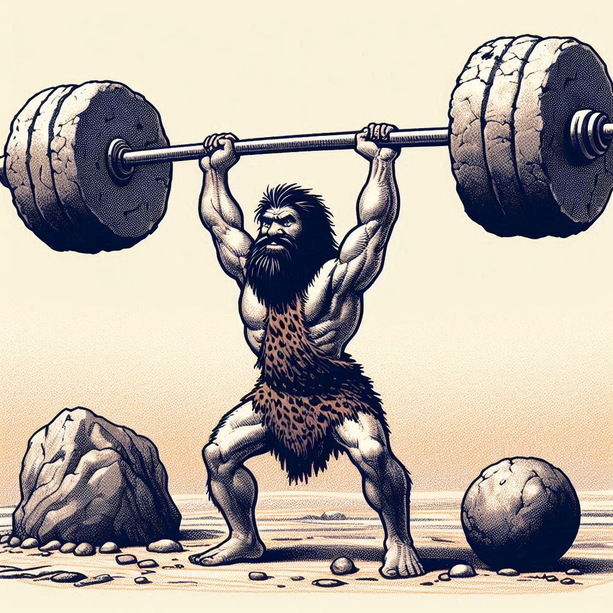

# KT Testes Unitários - Laboratório

## Sobre academia Bola de Ferro, Peso de Pedra...

O maior templo do halterofilismo desde o Crescente Fértil à Hélade, a **ACADEMIA BOLA DE FERRO, PESO DE PEDRA** elenca em
seu rol de atletas nomes como Gilgamesh, Hércules, Leonidas e Beowulf. No entando, mesmo contando com as bençãos
de diversos deuses da Força, a academia se viu frente a um perigoso inimigo: a ***EVOLUÇÃO***.

Outrora um marco de glória, cuja fama e reputação eram propagadas pelos feitos heróicos e semidivinos de seus atletas,
que enfrentaram deuses, mataram monstros lendários e venceram exércitos até então inexpugnáveis, a academia nunca se
preocupou muito com essa nova força mística chamada ***TECNOLOGIA***. No entanto, após pouco mais de quatro milênios
mantendo  os negócios mais ou menos sendo dirigidos da mesma forma, Kratos, titã da força e proprietário do local,
decidiu que era hora de mudar as coisas. Assim, ele recorreu a Godofredo, um jovem feiticeiro que se autoreferenciava
pelo título de *programador*. Godofredo apareceu próximo aos domínios da Academia Bola de Ferro, Peso de Pedra enquanto
viajava de férias pela grécia.

No entando o jovem não era muito versado nesta arte arcana conehcida como desenvolvimento de software, e acabou por
produzir um artefato cheio de imperfeições. Kratos, agora conhecendo melhor os poderes místicos da tecnologia, recorreu
ao Oráculo de Delfos, que lhe deu um augúrio bastante promissor: muito distante de seus domínios, onde fica localizada
sua academia, num reino conhecido como ***Brasil***, há um clã de estudiosos dessa arte arcana que podem ajudá-lo a
corrigir o artefato místico produzido pelo jovem, tornando-o plenamente funcional.

### O Que se sabe sobre o artefato (ou o que o sistema faz...)
O sistema deveria ser entregue por fases. Para esta primeira fase, 